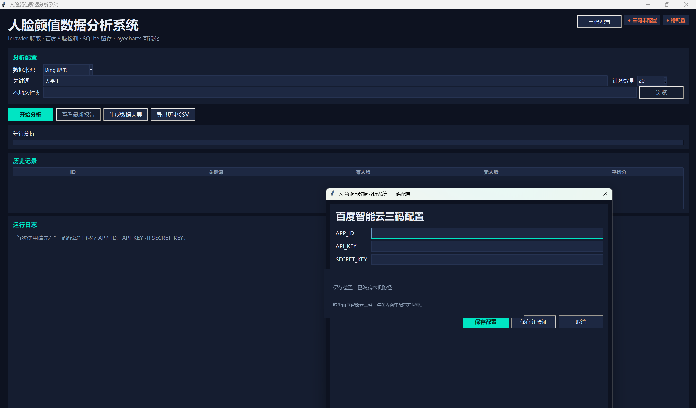

# 人脸颜值数据分析系统

[](https://github.com/zengrui2003/FaceInsight/releases/tag/v1.1.0)
[](https://www.python.org/)
[](LICENSE)

FaceInsight 是一个基于 Python 的人脸图像采集与颜值数据分析系统。项目支持关键词图片采集和本地图片分析，调用百度智能云人脸检测服务，并通过 SQLite 与 pyecharts 完成数据存储、历史管理、统计和可视化。

> 颜值分数具有主观性，本项目仅用于技术学习、课程展示和数据分析实验，不应作为评价个人的依据。

## 界面预览



## v1.1.0 更新

- 新增界面化三码配置，首次启动可直接填写、保存和验证百度智能云凭据。
- 新增 Windows 高分屏 DPI 感知和界面缩放适配。
- 历史数据库改为按 Windows 用户保存，避免不同用户共享历史记录。
- 配置写入改为原子操作，并增加配置结构版本与旧配置兼容处理。
- 首次运行会初始化用户数据并清理旧版程序目录中的共享配置或数据库。
- 扩充自动化测试，覆盖配置读写、首次运行、数据库迁移、认证和分数聚合。
- 产品名称和打包程序统一为“人脸颜值数据分析系统 / FaceBeautyAnalysisSystem”。

## 功能特性

- 按关键词从 Bing 采集图片，并过滤无效图片格式。
- 支持分析本地图片文件夹，便于在爬虫不可用时演示。
- 调用百度智能云检测年龄、表情和颜值字段。
- 将颜值结果按 `1-10` 分分段统计，`0` 表示未检测到人脸。
- 使用 SQLite 保存分析记录，支持历史查询和 CSV 导出。
- 使用 pyecharts 生成分数柱状图、占比图、趋势图、关键词对比和综合数据大屏。
- 使用 tkinter 构建深色主题桌面界面，并通过后台线程展示任务进度。
- 提供 PyInstaller 与 Inno Setup 的 Windows 打包脚本。

## 环境要求

- Windows 10/11
- Python 3.10 或更高版本（仅源码运行需要）
- 百度智能云账号，并已开通人脸检测服务
- 可访问互联网

## 安装程序运行方式

1. 前往 [GitHub Releases](https://github.com/zengrui2003/FaceInsight/releases/latest) 下载最新版安装程序。
2. 运行 `人脸颜值数据分析系统-安装程序-v1.1.0.exe`。
3. 如果 Windows SmartScreen 提示“未知发布者”，点击“更多信息”，确认来源后选择“仍要运行”。
4. 首次启动时点击“三码配置”，填写 `APP_ID`、`API_KEY` 和 `SECRET_KEY`。
5. 点击“保存并验证”，验证成功后即可开始分析。

当前安装程序尚未进行代码签名，因此 Windows 可能显示安全提醒。安装程序会在每次安装或覆盖升级时删除程序目录中的旧 `config.local.json`，重新安装后需要再次填写三码。

历史数据库保存在：

```text
%LOCALAPPDATA%\FaceBeautyAnalysisSystem\beauty_analysis.db
```

安装包不携带数据库，每位用户第一次运行时都从空白历史开始。

## 源码运行方式

```powershell
git clone https://github.com/zengrui2003/FaceInsight.git
cd FaceInsight
python -m venv .venv
.\.venv\Scripts\Activate.ps1
python -m pip install --upgrade pip
python -m pip install -r requirements.txt
python main.py
```

首次启动后直接在界面中填写并保存百度三码，不再要求手工编辑 JSON。

源码运行时配置保存在项目根目录：

```text
config.local.json
```

该文件已加入 `.gitignore`，请勿提交真实凭据。

## 数据说明

- `0` 表示没有检测到人脸。
- `1-10` 表示百度 `beauty` 分数换算后的分段。
- 平均分只统计有人脸的图片。
- 如果所有图片均无人脸，平均值为 `NULL`，图表显示“无有效人脸”。

## 测试

```powershell
python -m pip install -r requirements-dev.txt
python -m pytest
```

当前测试覆盖分数聚合、异常重试、配置读写、首次运行、旧配置迁移、认证验证和用户数据库路径。

## Windows 打包

安装 [PyInstaller](https://pyinstaller.org/) 和 [Inno Setup 6](https://jrsoftware.org/isinfo.php) 后，在项目根目录执行：

```powershell
powershell -ExecutionPolicy Bypass -File installer\build_installer.ps1
```

输出位置：

- `dist/FaceBeautyAnalysisSystem/`
- `installer/output/FaceBeautyAnalysisSystemSetup.exe`

## 项目结构

```text
FaceInsight/
├── face_insight/
│   ├── app.py              # tkinter 界面、三码配置和任务调度
│   ├── charts.py           # 图表与历史大屏
│   ├── config.py           # 用户配置、首次运行和迁移逻辑
│   ├── crawler.py          # 图片采集与格式过滤
│   ├── face_analysis.py    # 人脸检测、认证验证和分数聚合
│   └── storage.py          # 用户级 SQLite 数据访问
├── docs/                   # 演示文档
├── installer/              # PyInstaller / Inno Setup 构建脚本
├── scripts/                # 演示文稿生成脚本
├── tests/                  # 自动化测试
├── config.local.json.example
├── main.py
├── requirements.txt
└── README.md
```

## 常见问题

### 百度返回错误码 17

`Open api daily request limit reached` 表示当前应用当天调用额度已用完。请等待额度重置，或在百度智能云控制台检查并提升配额。

### 百度返回错误码 18

这是接口 QPS 限流。程序会自动等待并重试；如果频繁出现，可以增大 `FaceAnalyzer` 的 `request_interval`。

### 返回 `IAM Certification failed`

请检查三码是否正确，并确认百度应用已经开通人脸检测服务。

### 图片检测失败

百度接口不接受超过 10 MB 的图片。请压缩图片或降低采集图片尺寸。

## 许可证

本项目采用 [MIT License](LICENSE) 开源。